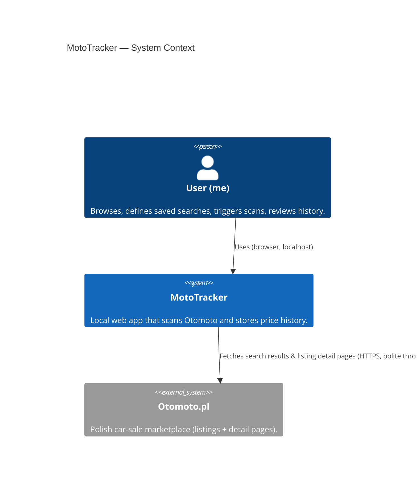
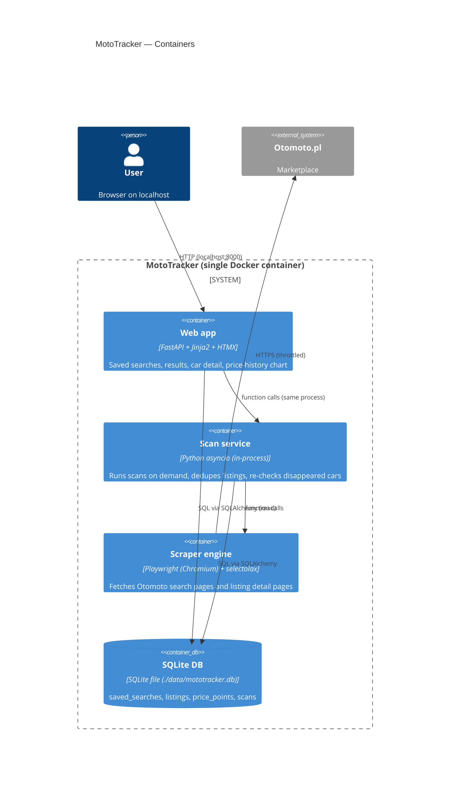

# Architecture — MotoTracker

## App type
Local web app (single user, runs on the user's machine; browser UI talks to a local backend).

## Tech stack
- **Language:** Python 3.12
- **Backend:** FastAPI (REST endpoints) + Uvicorn
- **Templates / UI:** Jinja2 + HTMX + Alpine.js. Chart.js (CDN) for the price-history chart. Tailwind CSS (via CDN play build for simplicity) for "clean" look.
- **ORM / migrations:** SQLAlchemy 2.x + Alembic
- **DB:** SQLite (single file under `./data/mototracker.db`)
- **Scraping:** Playwright (headless Chromium) as the primary engine — Otomoto uses anti-bot + client-side rendering; httpx is reserved for the listing-detail re-check (cheap HEAD/GET) when feasible.
- **HTML parsing:** selectolax (fast) with BeautifulSoup as fallback
- **Task running:** in-process background tasks via FastAPI's `BackgroundTasks` / `asyncio` (no Celery/Redis — overkill for single-user on-demand scans). Scan progress streamed to UI via Server-Sent Events.
- **Config:** Pydantic Settings (`.env` file)
- **Packaging:** `uv` for dependency management (fast, deterministic) with `pyproject.toml`

**Why this stack:**
- Python has the strongest scraping ecosystem (Playwright + httpx).
- FastAPI + Jinja + HTMX gives a single-process app with no JS build step — minimal friction for a local prototype.
- SQLite is perfect for single-user, file-backed history.

## Orchestration / containerization
- Single Docker image (Python + Playwright + Chromium pre-installed).
- Dev runs inside a `.devcontainer/` (VS Code / Cursor dev container).
- No Compose, no orchestrator — one container, one process tree.
- DB and scraping cache mounted as volumes so data persists across rebuilds.

## Deployment target
- Local machine only. App listens on `127.0.0.1:8000`. Started inside the dev container.

## C4 — System Context

## C4 — Container

## Data model (sketch)
- `saved_search` — id, name, filters_json (make, model, year_from, year_to, country_of_origin, condition), created_at
- `scan` — id, saved_search_id, started_at, finished_at, status, result_count
- `listing` — id (Otomoto ID, string), saved_search_id (first seen under), make, model, year, mileage, fuel, gearbox, vin (nullable), seller_id (nullable), url, title, location, first_seen_at, last_seen_at, status (`active` | `likely_sold` | `confirmed_sold`)
- `price_point` — id, listing_id, scan_id, price, currency, observed_at
- Fuzzy match key (computed column or index on `listing`): `(make, model, year, mileage_bucket, seller_id)` for re-listing detection.

## Integration strategy
| Service | Style | Auth | Contract | Mock policy | Error handling | First needed |
|---|---|---|---|---|---|---|
| Otomoto.pl | HTML scraping (Playwright + httpx detail re-check) | none (public pages) | external — fragile; selectors centralised in one module | Local fixture HTML files for unit-level scraper tests (skipped under `test_coverage=none` policy) | Polite throttle (≤1 req/s, jitter); retry 2× with backoff on 5xx; bail on captcha / 429; log + continue | First scan epic |

## Active roles
- **DEV** — full
- **DESIGN** — light (clean UI level)
- **SECURITY** — light (local-only, no auth, but throttling + secrets hygiene)
- Skipped: QA (test_coverage=none), DEVOPS, SRE, DATA

## Test types
- Per policy `test_coverage=none`: no automated tests in v1. Manual smoke only.

## Quality attributes (priority order)
1. Resilience to scrape failures (a broken selector mustn't lose existing data)
2. Politeness toward Otomoto (throttling, identifiable UA, low concurrency)
3. Data integrity (idempotent scans, never double-count price points)
4. UX clarity (clean tables + price-history chart)
5. Performance (acceptable for ≤500 listings/search)

## UI / design level
- **Clean** — Tailwind CDN, simple component palette, readable tables, one chart. No custom branding.

## Security posture
- **Auth:** none (binds to `127.0.0.1` only; no external exposure)
- **Secrets:** none required initially. Any future API keys via `.env` (gitignored) loaded by Pydantic Settings. Never committed.
- **Data sensitivity:** low — public marketplace listings only. No PII collected beyond what Otomoto shows publicly.
- **Scraping ethics:** identifiable user agent, throttled, no auth-walled content, no captcha bypass.
